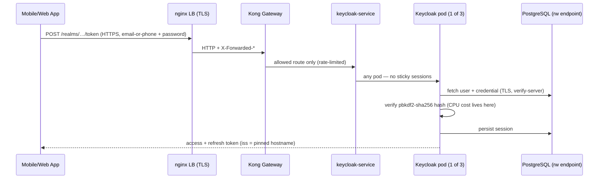

# The Manifests, Explained

A field-by-field walkthrough of `staging.yaml` and `production.yaml` — what
every block does, why it is there, and what would break without it. Written so
you can explain the deployment to a reviewer without opening anything else.

---

## 1. The big picture

Each file is a complete environment in four (staging) or three (production)
Kubernetes documents:

| Document | staging.yaml | production.yaml |
|---|---|---|
| `Namespace` | ✔ | ✔ |
| CloudNativePG `Cluster` (PostgreSQL) | ✔ | — (external client PG) |
| `Keycloak` (operator CR) | ✔ | ✔ |
| `PodDisruptionBudget` | ✔ | ✔ |

The central idea: **we do not write Deployments, StatefulSets, or Services for
Keycloak at all.** We write one `Keycloak` custom resource — a *declaration of
desired state* — and the official Keycloak Operator (installed once per
cluster) reads it and creates and maintains everything derived from it:

- a StatefulSet running the pods,
- `keycloak-service` (ClusterIP, port 8080) — what Kong points at,
- a headless discovery service the pods use to find each other and form a
  cluster (Infinispan/JGroups `DNS_PING`),
- readiness/liveness/startup probes on the management port (9000),
- default anti-affinity so two pods of the same CR never share a node
  (operator built-in since Keycloak 26.0).

The same pattern holds for staging PostgreSQL: one CNPG `Cluster` resource,
and the CNPG operator builds the actual database pods, services, and secrets.

The two files are deliberately **parallel**: `diff staging.yaml
production.yaml` shows exactly four intended differences — DB source, hostname,
resource sizing, and the CNPG block. Anything else showing up in the diff is a
drift bug.

---

## 2. `Namespace`

```yaml
apiVersion: v1
kind: Namespace
metadata:
  name: keycloak
```

The isolation boundary. Every resource in the file — and both operators'
workloads for us — lives in `keycloak`. RBAC, quotas, and network policy can
all be scoped here later without touching the manifests.

---

## 3. Staging PostgreSQL — the CNPG `Cluster` (staging.yaml only)

```yaml
apiVersion: postgresql.cnpg.io/v1
kind: Cluster
metadata:
  name: keycloak-pg
  namespace: keycloak
spec:
  instances: 2
  imageName: ghcr.io/cloudnative-pg/postgresql:16
  enableSuperuserAccess: true
  storage:
    size: 20Gi
  bootstrap:
    initdb:
      database: keycloak
      owner: keycloak
```

**Why it exists at all:** production Keycloak uses the client's external HA
PostgreSQL. Staging can't, so it needs a stand-in that honors the *same
contract*: one stable read-write endpoint, automatic failover, TLS. CNPG
provides exactly that in-cluster.

Field by field:

- **`instances: 2`** — a primary and a streaming replica. If the primary pod
  dies, CNPG promotes the replica and repoints the endpoint. This is what lets
  staging rehearse the failover behavior production will show.
- **`imageName: …postgresql:16`** — PostgreSQL 16, inside Keycloak 26's
  support matrix (≥ 15 per the requirement sheet handed to the client).
- **`enableSuperuserAccess: true`** — *staging-only convenience.* The
  migration rehearsal needs to create a scratch database and restore the
  vendor dump into it, which requires superuser. The production database is
  the client's; we never have (or need) superuser there.
- **`storage: 20Gi`** — generous for ~250–300 MB of real user data plus
  session tables; staging doesn't need the production 50 GB provisioning.
- **`bootstrap.initdb`** — on first start, create database `keycloak` owned by
  role `keycloak`. Keycloak manages its own schema inside it.

**What CNPG generates for us (nothing to configure):**

| Generated object | Purpose |
|---|---|
| Service `keycloak-pg-rw` | Stable read-write endpoint — always points at the current primary. This is the name the Keycloak CR uses. |
| Secret `keycloak-pg-app` | Username/password of the `keycloak` DB owner. Keycloak consumes it directly — no credentials ever typed or committed. |
| Secret `keycloak-pg-ca` | The CA that signs the Postgres server certificate (CNPG serves TLS by default). Keycloak verifies against it. |

---

## 4. The `Keycloak` CR — the heart of both files

### 4.1 Identity and scale

```yaml
apiVersion: k8s.keycloak.org/v2alpha1
kind: Keycloak
metadata:
  name: keycloak
  namespace: keycloak
spec:
  instances: 3
```

- **`v2alpha1`** is the apiVersion served by the operator's CRD at our pinned
  version (verified against the 26.5.2 schema).
- **`instances: 3`** — the HA number, and it is not arbitrary:
  - the design peak (60 logins/sec) must fit on **N-1 pods**, so capacity
    survives one pod being down for a node failure or a rolling upgrade;
  - 3 pods + the PDB (`minAvailable: 2`) means upgrades roll one pod at a
    time with 2 always serving;
  - the operator's default anti-affinity spreads them across 3 nodes, so one
    node loss costs one pod, not the service. (Hence the prerequisite: ≥ 3
    schedulable worker nodes.)
  - There is **no quorum requirement** — Keycloak pods are peers sharing
    state via the database and replicated caches; 2 running pods is a
    degraded-capacity state, not a split-brain risk.

```yaml
  image: <REGISTRY>/keycloak/keycloak:26.5.2
  startOptimized: false
```

**Air-gapped clusters change the image story.** Normally the operator deploys
its own matching image from quay.io — impossible without internet, so the
stock image is mirrored into the internal registry and pinned explicitly. Two
consequences worth explaining:

- The mirrored image must **match the operator version exactly** — the
  operator and server are released and tested as a pair.
- When `image` is set, the operator assumes a *pre-optimized* image and starts
  it with `--optimized`. The mirrored stock image is **not** augmented with
  our build-time options (database vendor, metrics), so `startOptimized:
  false` tells Keycloak to re-augment at startup — a few extra seconds per pod
  start, functionally identical. When the custom email-or-phone authenticator
  image is built locally (on the official base, options baked in) and pushed
  to the registry, it replaces this reference and `startOptimized` flips to
  `true`.

### 4.2 Database block

```yaml
  db:
    vendor: postgres
    host: keycloak-pg-rw.keycloak.svc        # prod: <CLIENT-PG-RW-ENDPOINT>
    database: keycloak
    usernameSecret: {name: keycloak-pg-app, key: username}   # prod: keycloak-db
    passwordSecret: {name: keycloak-pg-app, key: password}
    poolMinSize: 20
    poolInitialSize: 20
    poolMaxSize: 20
```

- **`vendor: postgres`** selects the JDBC driver and dialect.
- **`host`** — *the* environment difference. Staging: CNPG's read-write
  service. Production: the client's stable read-write endpoint (VIP / Patroni
  proxy / PgBouncer — whatever they run; Keycloak only needs the name to
  survive failover). Keycloak reconnects automatically when the endpoint
  repoints.
- **`usernameSecret` / `passwordSecret`** — credentials are referenced, never
  written. Staging's secret is machine-generated by CNPG; production's
  (`keycloak-db`) is created by hand from client-provided credentials.
- **Pool `20/20/20`** — min = initial = max, a *fixed-size* pool per the
  official HA guide: no resize latency on load spikes, and a connection count
  that is predictable by construction. 20 per pod × 3 pods = **60**, plus 10
  reserved for ops = the **70-connection budget** the client approved. If
  anyone asks "why is the pool not bigger": password hashing is CPU-bound, not
  DB-bound; the DB sees < 500 simple TPS at design peak.

### 4.3 HTTP, hostname, proxy — the edge contract

```yaml
  http:
    httpEnabled: true
  hostname:
    hostname: https://auth-staging.<CLIENT-DOMAIN>   # prod: https://auth.<CLIENT-DOMAIN>
  proxy:
    headers: xforwarded
```

These three blocks encode where TLS lives and what URL the world sees:

- **`httpEnabled: true`** — pods listen on plain HTTP :8080 because **TLS
  terminates at the nginx load balancer** in front of Kong. Inside the chain
  (nginx → Kong → service → pod) traffic is HTTP by design. (The
  database hop, by contrast, *is* TLS — §4.5.)
- **`hostname`** — the public URL, pinned. Every token Keycloak issues embeds
  this as the `iss` (issuer) claim, and apps/libraries validate it. Wrong or
  unpinned hostname = tokens with the wrong issuer = every client app rejects
  them. This is also why cutover can be invisible: keep the auth domain, and
  the issuer never changes.
- **`proxy.headers: xforwarded`** — tells Keycloak to trust
  `X-Forwarded-For/-Proto/-Host` from the proxy chain. Without it Keycloak
  would see every request as coming from Kong's IP — which would break
  brute-force detection (all users would share one "IP") and generate
  redirect URLs with internal hosts.

### 4.4 Bootstrap admin

```yaml
  bootstrapAdmin:
    user:
      secret: keycloak-bootstrap-admin
```

First-boot admin credentials, read from a secret created by hand (never
committed). Operational rule: after go-live, log in, create named admin
accounts, and disable/rotate the bootstrap user. The admin console itself is
never reachable publicly — Kong routes only the public OIDC paths and
explicitly 403s `/admin` and `/realms/master`.

### 4.5 Database TLS

```yaml
  truststores:
    db-ca:
      secret:
        name: keycloak-pg-ca          # prod: keycloak-db-ca
  additionalOptions:
    - name: db-tls-mode
      value: verify-server
```

The JDBC connection to PostgreSQL is encrypted **and the server's identity is
verified** against a CA we provide:

- `truststores` mounts a CA certificate into Keycloak's trust store.
  Staging uses the CA CNPG generated; production uses `keycloak-db-ca`,
  created from the PEM the client's DBA team provides.
- `db-tls-mode: verify-server` refuses the connection if the certificate
  doesn't validate — protection against a spoofed database endpoint, not just
  passive snooping.
- If the client's PostgreSQL turns out not to serve TLS, removing this pair is
  a **recorded risk decision with the client**, never a silent default.

### 4.6 Observability options

```yaml
    - name: metrics-enabled
      value: "true"
    - name: event-metrics-user-enabled
      value: "true"
    - name: log-console-output
      value: json
```

- **`metrics-enabled`** — Prometheus metrics on the management port (9000),
  scraped by the client's Prometheus. Feeds the agreed alerts: token-endpoint
  failure rate, DB pool saturation, restarts.
- **`event-metrics-user-enabled`** — per-event counters (login success,
  login failure, logout). This is the metric behind "alert if login failures
  spike after cutover".
- **`log-console-output: json`** — structured logs, one JSON object per line,
  ready for the client's log aggregation without custom parsing.

### 4.7 Resources — the sizing story

```yaml
  resources:                     # staging          production
    requests: {cpu: 500m,  memory: 1200Mi}   # 1500m / 2Gi
    limits:   {cpu: "1",   memory: 1500Mi}   # 3     / 3Gi
```

Production numbers are the client-approved sizing: the dominant login cost is
password-hash verification (~15 password logins/sec per vCPU all-inclusive),
so 60/sec peak needs ~4 vCPU — which fits on **two** production pods (N-1)
with 3000m limits. Memory: JVM at operator default `MaxRAMPercentage=70`,
and because sessions live in the database (Keycloak 26 default), pod memory
does **not** grow with logged-in users — 2 Gi is stable state, 3 Gi the
ceiling.

Staging keeps the *shape* (3 pods, same config) at about a third of the
resources: it rehearses behavior — clustering, spreading, rolling upgrades,
failover — not absolute capacity. Capacity is validated separately by the k6
load test against staging.

### 4.8 What is deliberately *not* in the file

Worth saying out loud in a review, because absences look like omissions:

| Not configured | Why |
|---|---|
| Probes | Operator wires readiness/liveness/startup on port 9000 automatically |
| Anti-affinity / `scheduling` | Operator default since 26.0 spreads same-CR pods across nodes |
| Clustering config | Infinispan/JGroups discovery is automatic via the operator's headless service |
| JVM flags | Operator default (`MaxRAMPercentage=70`) sized by the memory limit |
| TLS keypair on the pod | TLS is the edge's job (nginx); pods speak HTTP internally |
| Realm content | Arrives via `KeycloakRealmImport` from the migration pipeline — content, not infrastructure |

---

## 5. `PodDisruptionBudget`

```yaml
apiVersion: policy/v1
kind: PodDisruptionBudget
spec:
  minAvailable: 2
  selector:
    matchLabels:
      app: keycloak
      app.kubernetes.io/managed-by: keycloak-operator
      app.kubernetes.io/component: server
```

Protects against **voluntary** disruptions — node drains, cluster upgrades,
`kubectl drain` — by refusing an eviction that would leave fewer than 2 pods.
Combined with 3 instances: maintenance can only proceed one pod at a time, and
login capacity (which fits on 2 pods) is never lost during it. The label
selector matches the pods the operator creates for our CR (it does not manage
a PDB itself, so this is the one piece of "raw" Kubernetes we add). Note it
does *not* protect against involuntary failures (node crash) — that's what
the 3-way spread is for.

---

## 6. How a login flows through what these files build



Points to land while showing this: any pod can serve any request (replicated
caches + DB sessions — no stickiness anywhere); the hash verification step is
why sizing is CPU-anchored; the issuer in the token is why `hostname` is
pinned; Kong only routes the public OIDC paths, so the admin console never
appears in this picture.

---

## 7. Review-meeting FAQ

**Why not Helm?** Keycloak ships no official Helm chart; its production
path on Kubernetes *is* the operator. Community charts (Bitnami, codecentric)
bypass the operator and lose `KeycloakRealmImport`, which the migration
depends on. Plain per-environment YAML also means the only tool needed on the
cluster is `kubectl`.

**Why 3 replicas and not 2?** Peak load must fit on N-1 pods. With 2 pods,
one down (upgrade or node loss) puts 100% of peak on a single pod with zero
headroom. 3 gives upgrade-without-degradation plus one-node-loss tolerance.

**What happens when a node dies?** One pod dies with it (anti-affinity means
never more than one). The other two carry full peak. The StatefulSet
reschedules the third elsewhere. Sessions are unaffected — they're in the
database.

**What happens when the DB primary fails over?** The read-write endpoint
(CNPG's `-rw` in staging, the client's VIP/proxy in production) repoints to
the new primary; Keycloak's pool reconnects to the same name. Staging
rehearses exactly this (`kubectl delete pod` on the primary mid-traffic).

**Where are the passwords/secrets?** Nowhere in git. Two are created by hand
per cluster (`keycloak-bootstrap-admin`; production also `keycloak-db` +
`keycloak-db-ca`), the staging DB pair is machine-generated by CNPG.

**How do we upgrade Keycloak later?** Bump the pinned operator version
(one variable in the install notes), apply to staging, let it roll pod-by-pod
under the PDB, validate, then production. Both files/clusters always move
together.

**Why is the pool fixed at 20?** Predictability: 60 connections total by
construction, matching the client-approved 70-connection budget, with no
pool-resize latency under load. Logins are CPU-bound (hashing), not DB-bound.

**How does anything get installed without internet?** Everything arrives
through two doors, both under our control: the git repo (vendored operator
manifests, the two environment files) and the internal container registry
(four mirrored images, pulled for `linux/amd64` on a connected machine and
pushed across the air gap). At install time nothing references the internet —
manifests apply from the repo, images pull from `<REGISTRY>`. A version bump
re-runs that mirroring, which is a feature: the air gap makes every upgrade an
explicit, auditable delivery.

**Why HTTP inside the cluster but TLS to the database?** The HTTP hop is
inside the client's trusted network path behind their TLS-terminating edge —
their existing pattern for all services behind Kong. The database connection
crosses to an external system carrying credentials and user data, so it gets
encryption *and* server verification.
